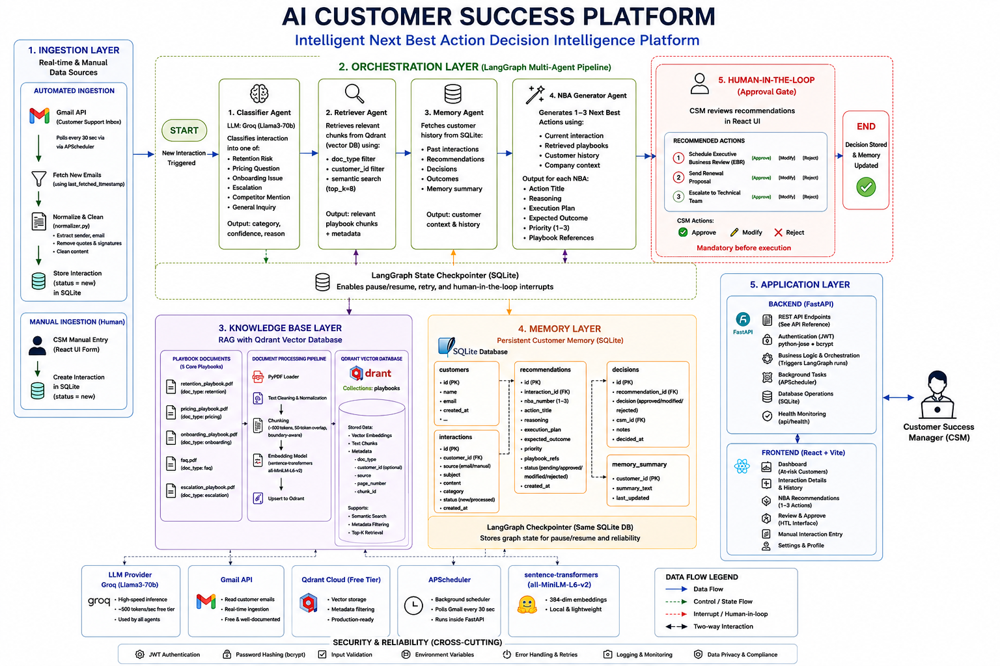
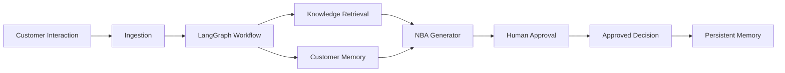

# 🤖 AI Customer Success Platform

> **Intelligent Next Best Action (NBA) Decision Intelligence Platform**  
> **Built for XLVentures.AI Hackathon 2026**

<p align="center">


</p>

---

## 📑 Table of Contents

- [👥 Team](#-team)
- [🚀 Project Overview](#-project-overview)
- [❗ Problem Statement](#-problem-statement)
- [💡 Solution Overview](#-solution-overview)
- [🏗️ System Architecture](#️-system-architecture)


---

# 👥 Team

| Name | Role |
|------|------|
| **Mahalaxmi Somisetty** | AI & Backend Development |
| **Harshini Vykuntapu** | Frontend Development |
| **Lasya Sothuku** | AI Integration & Testing |

**Hackathon:** XLVentures.AI Hackathon 2026

---

# 🚀 Project Overview

Customer Success Managers spend a significant amount of time manually analyzing customer interactions before deciding the next course of action. Important customer signals are often scattered across emails, meeting notes, CRM updates, and previous conversations, making it difficult to respond consistently and proactively.

The **AI Customer Success Platform** is an intelligent decision-support system that automates this workflow using a **multi-agent AI architecture**. The platform analyzes customer interactions, retrieves relevant organizational knowledge, understands historical customer context, and generates personalized **Next Best Action (NBA)** recommendations.

Unlike traditional AI assistants, the platform is designed around a **Human-in-the-Loop (HITL)** workflow where AI assists decision-making while Customer Success Managers retain complete control over customer-facing actions.

### Core Capabilities

- 📧 Automatically monitor customer emails
- 📝 Analyze manual customer interactions
- 🧠 Retrieve relevant company knowledge using RAG
- 👤 Understand customer history through persistent memory
- 🤖 Generate personalized Next Best Actions
- ✅ Allow managers to review, edit, approve, or reject recommendations
- 📈 Learn from approved decisions to improve future recommendations

---

# ❗ Problem Statement

Customer Success teams handle interactions from multiple channels, including:

- Emails
- Meeting Notes
- Phone Calls
- CRM Updates
- Support Tickets
- Slack Conversations

Before responding, Customer Success Managers typically need to:

- Read the interaction
- Understand customer intent
- Review previous conversations
- Search internal documentation
- Assess customer health
- Decide the best response
- Draft emails or meeting plans

This process is manual, time-consuming, and often inconsistent across different team members.

### Challenges

| Challenge | Impact |
|-----------|--------|
| Fragmented customer information | Slower decision making |
| Manual document search | Reduced productivity |
| Lack of historical context | Generic recommendations |
| Inconsistent responses | Poor customer experience |
| No organizational learning | Valuable knowledge is lost over time |

---

# 💡 Solution Overview

The AI Customer Success Platform combines **Retrieval-Augmented Generation (RAG)**, **Persistent Customer Memory**, and **Multi-Agent AI** to provide intelligent decision support for Customer Success teams.

When a new customer interaction is received, the platform automatically:

1. Collects the interaction from Gmail or Manual Input
2. Retrieves customer history from the database
3. Searches company playbooks using semantic search
4. Executes a LangGraph-based multi-agent workflow
5. Generates personalized Next Best Action recommendations
6. Presents recommendations for human approval
7. Stores approved decisions for future learning

Every recommendation includes:

- Recommended Action
- Confidence Score
- Supporting Reasoning
- Evidence from Company Playbooks
- Customer Context
- Execution Plan

---

# 🏗️ System Architecture

The platform follows a **Layered Multi-Agent Architecture**, separating data ingestion, AI orchestration, knowledge retrieval, customer memory, and human approval into independent components.

> 📖 **Detailed Architecture Documentation:**  
> See [`architecture.md`](architecture.md)

### High-Level Architecture

```text
                    Customer Interaction
                             │
                             ▼
                  Ingestion Layer
          (Gmail + Manual Interaction)
                             │
                             ▼
             LangGraph Orchestration Layer
                             │
       ┌───────────────┬───────────────┐
       ▼               ▼               ▼
  Classifier      Retriever      Memory Agent
       └───────────────┬───────────────┘
                       ▼
              NBA Generator Agent
                       │
                       ▼
            Human Approval Workflow
                       │
                       ▼
              Persistent Customer Memory
```


```md

```

---

|
| 💻 GitHub Repository | `https://github.com/mahalaxmi246/customer-success-ai` |

---

# ✨ Key Features

- 📧 **Automated Gmail Monitoring**  
  Continuously polls the configured Gmail inbox and automatically triggers AI analysis whenever a new customer email is received.

- 📝 **Manual Interaction Analysis**  
  Supports customer interactions from meetings, phone calls, CRM notes, and support tickets through a simple web interface.

- 🤖 **Multi-Agent AI Workflow**  
  Uses a LangGraph-powered workflow where specialized AI agents collaborate to analyze customer interactions and generate recommendations.

- 📚 **Retrieval-Augmented Generation (RAG)**  
  Retrieves relevant company playbooks and documentation from a vector database to generate grounded, context-aware recommendations.

- 🧠 **Persistent Customer Memory**  
  Maintains customer history and previously approved decisions to provide personalized recommendations over time.

- ✅ **Human-in-the-Loop Approval**  
  AI recommendations are reviewed, edited, approved, or rejected by Customer Success Managers before execution.

- 📊 **Explainable Recommendations**  
  Every recommendation includes confidence scores, reasoning, supporting evidence, and an execution plan.

- 📈 **Continuous Learning**  
  Approved decisions become part of the customer's history, improving future recommendations.

---

# 🛠️ Technology Stack

| Layer | Technology |
|---------|------------|
| **Frontend** | React, Tailwind CSS |
| **Backend** | FastAPI |
| **AI Workflow** | LangGraph |
| **LLM** | Groq (Llama 3) |
| **Knowledge Base** | Qdrant |
| **Database** | SQLite |
| **Embeddings** | Sentence Transformers |
| **Scheduler** | APScheduler |
| **ORM** | SQLAlchemy |
| **Document Processing** | PyPDF |

---

# 📂 Repository Structure

```text
customer-success-ai/
│
├── backend/
│   ├── agents/
│   ├── api/
│   ├── database/
│   ├── rag/
│   ├── scheduler/
│   ├── services/
│   ├── models/
│   └── main.py
│
├── frontend/
│   ├── src/
│   ├── components/
│   ├── pages/
│   └── services/
│
├── playbooks/
│
├── docs/
│   └── architecture.md
│
├── README.md
└── LICENSE
```

---

# 📚 Project Workflow

The platform follows an event-driven workflow where every new customer interaction is enriched with organizational knowledge and customer history before generating personalized recommendations.



---

## Workflow Summary

1. Customer interaction is received from Gmail or the Manual Interaction Form.
2. The interaction is normalized and stored in the database.
3. LangGraph initiates the multi-agent workflow.
4. Relevant company knowledge is retrieved from the knowledge base.
5. Historical customer context is retrieved from persistent memory.
6. The NBA Generator creates personalized recommendations.
7. Customer Success Managers review, edit, approve, or reject recommendations.
8. Approved decisions are stored to improve future recommendations.

---

# 🤖 Why Multi-Agent AI?

Instead of relying on a single LLM prompt, the platform distributes responsibilities across specialized AI agents.

This approach offers several advantages:

- Better reasoning through specialized agents
- Easier maintenance and debugging
- Improved explainability
- Flexible workflow orchestration
- Simple integration of future AI agents
- More accurate recommendations through context enrichment

> 📖 Interested in the engineering details?
>
> The complete system design, agent architecture, and design decisions are documented in **[`architecture.md`](architecture.md)**.
---
# ⚙️ Setup & Installation

## Prerequisites

Before running the project, ensure the following are installed:

- Python 3.11+
- Node.js 18+
- Docker Desktop
- Git
- Groq API Key
- Google Cloud Project (for Gmail API)

---

## 1. Clone the Repository

```bash
git clone https://github.com/mahalaxmi246/customer-success-ai.git
cd customer-success-ai
```

---

## 2. Backend Setup

```bash
cd backend

python -m venv venv

# Windows
venv\Scripts\activate

# Linux / macOS
source venv/bin/activate

pip install -r requirements.txt
```

---

## 3. Frontend Setup

```bash
cd ../frontend

npm install
```

---

## 4. Configure Environment Variables

Create a `.env` file inside the **backend** directory.

```env
GROQ_API_KEY=your_groq_api_key

QDRANT_HOST=localhost
QDRANT_PORT=6333
QDRANT_COLLECTION=playbooks

DATABASE_URL=sqlite:///./customer_success.db

GMAIL_CREDENTIALS_PATH=credentials.json
GMAIL_TOKEN_PATH=token.json

SECRET_KEY=your_secret_key
```

---

## 5. Gmail API Configuration

1. Create a project in **Google Cloud Console**
2. Enable the **Gmail API**
3. Configure the OAuth Consent Screen
4. Create an OAuth Client (Desktop Application)
5. Download the credentials file
6. Rename it to:

```text
credentials.json
```

7. Place it inside the **backend/** directory.

---

## 6. Start Qdrant

```bash
docker run -p 6333:6333 qdrant/qdrant
```

Qdrant Dashboard:

```
http://localhost:6333/dashboard
```

---

## 7. Index Playbooks

```bash
cd backend

python ingest.py
```

This indexes the company playbooks into the Qdrant vector database.

---

## 8. Seed Sample Data

```bash
python seed.py
```

This creates sample:

- Customers
- Customer interactions
- Customer memory
- Historical recommendations

for demonstration purposes.

---

## 9. Start the Backend

```bash
python main.py
```

Backend URL

```
http://localhost:8000
```

Interactive API Documentation

```
http://localhost:8000/docs
```

---

## 10. Start the Frontend

```bash
cd frontend

npm run dev
```

Frontend URL

```
http://localhost:5173
```

---

# 📡 API Reference

| Method | Endpoint | Description |
|---------|----------|-------------|
| POST | `/api/interactions/manual` | Submit a manual customer interaction |
| GET | `/api/interactions` | Retrieve all customer interactions |
| GET | `/api/customers` | Retrieve customer list |
| GET | `/api/customers/{id}` | Retrieve customer details |
| POST | `/api/interactions/{id}/approve` | Approve AI recommendation |
| POST | `/api/interactions/{id}/reject` | Reject AI recommendation |
| GET | `/api/health` | Check application health |

---

# 🔗 Repository

| Resource | Link |
|----------|------|
| GitHub Repository | https://github.com/mahalaxmi246/customer-success-ai |
| Architecture Documentation | `architecture.md` |


---

# 📝 Additional Notes

- Built for **XLVentures.AI Hackathon 2026**.
- Customer interactions and playbooks are pre-seeded for demonstration purposes.
- AI recommendations always require **Human-in-the-Loop approval** before execution.
- Company playbooks are automatically indexed into Qdrant during initialization.
- The architecture is designed to support future integrations with CRM platforms such as Salesforce, HubSpot, and Slack.
- For detailed system design, workflow diagrams, and architectural decisions, refer to **`docs/architecture.md`**.

---

# 🚀 Future Improvements

- Salesforce Integration
- HubSpot Integration
- Slack Integration
- Automated Email Sending
- PostgreSQL Migration
- Redis Caching
- Kubernetes Deployment
- Role-Based Access Control (RBAC)
- Analytics Dashboard
- Multi-LLM Support
- Customer Health Prediction
- Churn Prediction Agent

---

