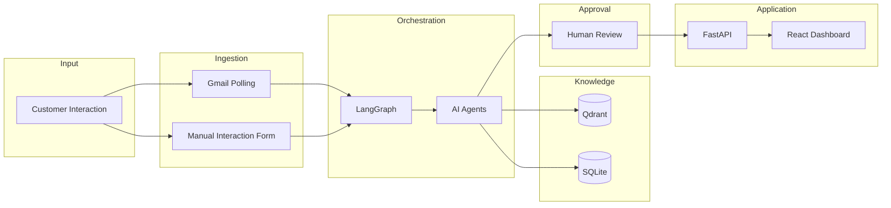
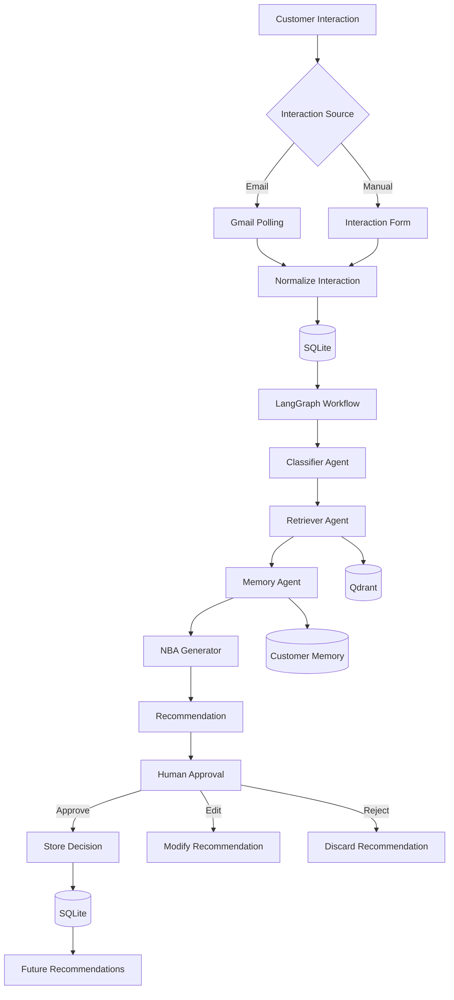
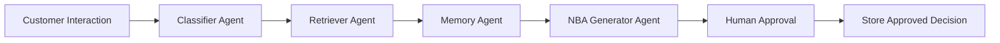
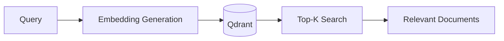
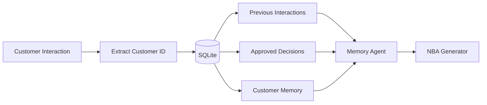

# 🏗️ AI Customer Success Platform Architecture

This document describes the system architecture of the **AI Customer Success Platform**, explaining how its layered architecture, multi-agent orchestration, retrieval pipeline, and human approval workflow work together to generate intelligent **Next Best Action (NBA)** recommendations.

---

## Table of Contents

1. Architecture Goals
2. High-Level Architecture
3. End-to-End Workflow
4. Multi-Agent Architecture
5. Key Design Decisions
6. Future Enhancements

---

# Architecture Goals

The architecture is designed around the following principles:

| Goal | Description |
|------|-------------|
| **Modular Architecture** | Separate responsibilities into independent layers and agents for maintainability and extensibility. |
| **Context-Aware AI** | Combine customer interactions, historical memory, and organizational knowledge before generating recommendations. |
| **Explainable Recommendations** | Every recommendation includes supporting evidence and reasoning. |
| **Human-in-the-Loop** | Customer Success Managers retain complete control over customer-facing decisions. |
| **Persistent Learning** | Approved decisions are stored to improve future recommendations. |
| **Scalable Foundation** | The architecture can evolve to support enterprise integrations and cloud deployment. |

---

# High-Level Architecture

The platform follows a **Layered Architecture** where each layer has a single responsibility. Customer interactions are ingested, enriched with organizational knowledge and customer history, processed through a LangGraph-based multi-agent workflow, and finally presented to a Customer Success Manager for approval before becoming part of the platform's persistent memory.



---

## Layer Responsibilities

| Layer | Responsibility | Technologies |
|---------|----------------|--------------|
| **Input Layer** | Receive customer interactions from supported sources | Gmail, React |
| **Ingestion Layer** | Normalize interactions and trigger AI workflow | FastAPI, APScheduler |
| **Orchestration Layer** | Coordinate the execution of AI agents | LangGraph |
| **Knowledge Layer** | Retrieve organization-specific knowledge | Qdrant, Sentence Transformers |
| **Memory Layer** | Retrieve customer history and previous approvals | SQLite, SQLAlchemy |
| **Approval Layer** | Allow Customer Success Managers to review recommendations | React |
| **Application Layer** | Expose REST APIs and user interface | FastAPI, React |

---
# End-to-End Workflow

The platform follows an event-driven workflow where every customer interaction is transformed into an evidence-backed **Next Best Action (NBA)** recommendation. Each stage contributes a specific capability while maintaining modularity, explainability, and human oversight.

## Workflow



---

## Workflow Explanation

| Step | Description |
|------|-------------|
| **1. Interaction Received** | Customer interactions are received either through Gmail or the Manual Interaction Form. |
| **2. Data Normalization** | The interaction is cleaned, validated, and converted into a standardized format. |
| **3. Store Interaction** | The normalized interaction is stored in SQLite for tracking and future reference. |
| **4. Trigger Workflow** | LangGraph initiates the multi-agent workflow. |
| **5. Interaction Classification** | The Classifier Agent identifies customer intent, interaction type, and priority. |
| **6. Knowledge Retrieval** | The Retriever Agent searches company playbooks and documentation stored in Qdrant. |
| **7. Memory Retrieval** | The Memory Agent retrieves historical customer interactions and previous decisions. |
| **8. Recommendation Generation** | The NBA Generator combines the retrieved context and generates personalized Next Best Actions. |
| **9. Human Approval** | Customer Success Managers review, edit, approve, or reject the recommendation. |
| **10. Memory Update** | Approved decisions are stored to improve future recommendations. |

---

## Layered Data Flow

```text
Customer Interaction
        │
        ▼
Ingestion Layer
        │
        ▼
SQLite
        │
        ▼
LangGraph Orchestration
        │
        ▼
 ┌───────────────┬────────────────┐
 │               │                │
 ▼               ▼                ▼
Classifier   Retriever      Memory Agent
                  │                │
                  ▼                ▼
              Qdrant         Customer Memory
                  └────────────┬────────────┘
                               ▼
                     NBA Generator Agent
                               │
                               ▼
                   Human Approval Interface
                               │
                               ▼
                      Approved Decision
                               │
                               ▼
                     Persistent Customer Memory
```

---

## Design Highlights

| Feature | Benefit |
|---------|---------|
| **Event-Driven Processing** | AI executes only when new customer interactions arrive, reducing unnecessary computation. |
| **Layered Architecture** | Clear separation of concerns improves maintainability and debugging. |
| **Knowledge + Memory Fusion** | Recommendations combine organizational knowledge with customer history for better personalization. |
| **Human Approval** | Ensures AI remains a decision-support system rather than an autonomous decision-maker. |
| **Persistent Learning** | Every approved recommendation strengthens future decision-making. |

---

> [!TIP]
> Rather than relying on a single LLM prompt, the platform progressively enriches customer interactions with semantic knowledge and historical memory before generating recommendations. This approach produces more accurate, explainable, and context-aware Next Best Actions.

---

> [!IMPORTANT]
> The architecture intentionally separates orchestration, retrieval, memory, and approval into independent layers. This improves maintainability, simplifies debugging, and allows future components to be added without affecting the overall workflow.
>
> ---
>
# Multi-Agent Architecture

The AI Customer Success Platform follows a **multi-agent architecture** where each agent performs a specialized task within the recommendation pipeline. Instead of relying on a single LLM prompt, responsibilities are distributed across independent agents, making the system more modular, explainable, and easier to extend.

---

## Agent Workflow



---

## Agent Responsibilities

| Agent | Responsibility | Input | Output |
|--------|---------------|-------|--------|
| **Classifier Agent** | Understand customer interaction | Interaction | Intent, Priority, Category |
| **Retriever Agent** | Retrieve relevant company knowledge | Intent + Interaction | Playbook Context |
| **Memory Agent** | Fetch historical customer information | Customer ID | Customer Context |
| **NBA Generator Agent** | Generate personalized recommendations | Combined Context | Next Best Actions |

---

# Classifier Agent

The **Classifier Agent** is the entry point of the AI workflow. It analyzes the incoming interaction to understand the customer's intent before downstream agents begin processing.

### Responsibilities

- Identify interaction type
- Detect customer intent
- Determine urgency
- Extract business context

### Input

- Customer interaction

### Output

- Interaction category
- Customer intent
- Priority level

### Example

| Attribute | Value |
|-----------|-------|
| Intent | Renewal Concern |
| Priority | High |
| Interaction Type | Email |

> **Why this Agent?**
>
> Early classification allows downstream agents to retrieve only the most relevant knowledge and customer history, improving both accuracy and efficiency.

---

# Retriever Agent

The **Retriever Agent** grounds AI reasoning using organization-specific knowledge stored in the vector database.

Instead of relying solely on pretrained LLM knowledge, the agent retrieves relevant company documentation using semantic similarity search.

### Responsibilities

- Search company playbooks
- Retrieve pricing policies
- Retrieve onboarding guides
- Retrieve FAQs
- Return relevant document chunks

### Knowledge Retrieval Pipeline



### Technologies

| Component | Technology |
|-----------|------------|
| Embedding Model | Sentence Transformers |
| Vector Database | Qdrant |
| Retrieval Framework | LangChain |

> **Why Semantic Search?**
>
> Customers rarely use the same wording as internal documentation. Semantic search retrieves documents based on meaning rather than exact keywords, resulting in more relevant context.

---

# Memory Agent

The **Memory Agent** retrieves historical customer information to ensure recommendations are personalized rather than stateless.

### Responsibilities

- Retrieve customer profile
- Fetch previous interactions
- Retrieve approved recommendations
- Provide historical context

### Retrieved Context

- Previous conversations
- Renewal history
- Customer health score
- Earlier AI recommendations
- Approved actions
### Memory Retrieval Workflow


---

# NBA Generator Agent

The **Next Best Action (NBA) Generator Agent** is responsible for generating personalized recommendations by combining:

- Current interaction
- Organization knowledge
- Customer history
- Previous approvals

### Responsibilities

- Merge retrieved context
- Perform AI reasoning
- Rank recommendations
- Generate execution plan
- Estimate confidence

### Recommendation Structure

| Field | Description |
|--------|-------------|
| Recommendation | Suggested next action |
| Confidence | Estimated confidence score |
| Reasoning | Explanation of recommendation |
| Evidence | Supporting playbooks and customer history |
| Execution Plan | Suggested implementation steps |

### Example

| Field | Example |
|--------|---------|
| Recommendation | Schedule Retention Meeting |
| Confidence | 94% |
| Evidence | Pricing Playbook, Previous Renewal Discussion |
| Reasoning | Customer expressed pricing concerns and showed churn signals similar to previous retention cases. |

---
---

## Multi-Agent Design Benefits

| Design Choice | Benefit |
|---------------|---------|
| Specialized Agents | Single responsibility improves maintainability. |
| Sequential Reasoning | Each agent enriches the context before passing it forward. |
| Context Fusion | Combines organizational knowledge with customer history. |
| Explainability | Every recommendation is backed by evidence and reasoning. |
| Extensibility | New agents can be added without redesigning the workflow. |

---

> [!IMPORTANT]
> The platform intentionally separates **classification**, **knowledge retrieval**, **memory retrieval**, and **recommendation generation** into independent agents. This modular approach improves maintainability, simplifies debugging, enables future agent expansion, and produces more accurate recommendations than a single monolithic LLM prompt.
>
> ---
>
 # Key Design Decisions

The following architectural decisions were made to balance simplicity, maintainability, and extensibility while delivering a production-inspired MVP suitable for a hackathon.

| Decision | Rationale |
|----------|-----------|
| **Layered Architecture** | Separates responsibilities into independent layers, improving maintainability and making the system easier to understand and extend. |
| **LangGraph for Orchestration** | Provides stateful workflow management for coordinating multiple AI agents. |
| **Multi-Agent Design** | Each agent performs a single specialized task, making the workflow modular and easier to debug. |
| **Retrieval-Augmented Generation (RAG)** | Grounds LLM responses using organization-specific knowledge, reducing hallucinations. |
| **Qdrant Vector Database** | Enables fast semantic search over company playbooks and documentation. |
| **Sentence Transformers** | Generates lightweight, high-quality embeddings locally without relying on external embedding APIs. |
| **SQLite for MVP** | Lightweight, serverless database that simplifies local development and hackathon deployment. |
| **Human-in-the-Loop Approval** | Ensures customer-facing actions are always reviewed before execution, increasing trust and reducing business risk. |
| **Persistent Customer Memory** | Stores approved decisions and historical interactions to generate increasingly personalized recommendations. |
| **Manual Interaction Form** | Supports CRM notes, meeting summaries, and call logs without requiring integrations with multiple third-party platforms. |

---

# Technology Stack

| Layer | Technology | Purpose |
|---------|------------|---------|
| **Frontend** | React + Tailwind CSS | Customer Success Dashboard |
| **Backend** | FastAPI | REST APIs & Business Logic |
| **AI Workflow** | LangGraph | Multi-Agent Orchestration |
| **LLM** | Groq | High-speed inference |
| **Knowledge Base** | Qdrant | Vector database for semantic retrieval |
| **Embeddings** | Sentence Transformers | Generate document embeddings |
| **Database** | SQLite | Store customer data and interaction history |
| **ORM** | SQLAlchemy | Database abstraction |
| **Scheduler** | APScheduler | Background Gmail polling |
| **Document Processing** | PyPDF | Extract text from playbooks |

---

# Future Enhancements

The current implementation focuses on delivering a complete end-to-end MVP. The architecture is intentionally modular, allowing future enhancements without major structural changes.

## Planned Improvements

### Enterprise Integrations

- Salesforce
- HubSpot
- Slack
- Microsoft Teams
- Jira

### AI Enhancements

- Churn Prediction Agent
- Customer Health Agent
- Sentiment Analysis Agent
- Automatic Email Generation
- Multi-LLM Routing
- Outcome-based recommendation learning

### Infrastructure

- PostgreSQL
- Redis
- Docker
- Kubernetes
- Cloud Deployment (AWS / Azure / GCP)
- CI/CD Pipeline

### Platform Features

- Role-Based Authentication
- Playbook Upload Interface
- Analytics Dashboard
- Audit Logs
- Real-time Notifications
- Feedback Collection for Recommendation Quality

---

# Architecture Summary

| Aspect | Implementation |
|---------|----------------|
| **Architecture Style** | Layered Multi-Agent Architecture |
| **Workflow Engine** | LangGraph |
| **Knowledge Retrieval** | Retrieval-Augmented Generation (RAG) |
| **Vector Database** | Qdrant |
| **Persistent Memory** | SQLite |
| **LLM** | Groq |
| **Backend Framework** | FastAPI |
| **Frontend Framework** | React |
| **Human Oversight** | Human-in-the-Loop Approval |

---

> [!NOTE]
> This architecture was designed to demonstrate a complete AI-powered Customer Success workflow while remaining lightweight enough for a hackathon MVP. By combining Retrieval-Augmented Generation (RAG), persistent customer memory, modular AI agents, and Human-in-the-Loop approval, the platform delivers accurate, explainable, and context-aware Next Best Action recommendations while providing a strong foundation for future enterprise-scale enhancements.
